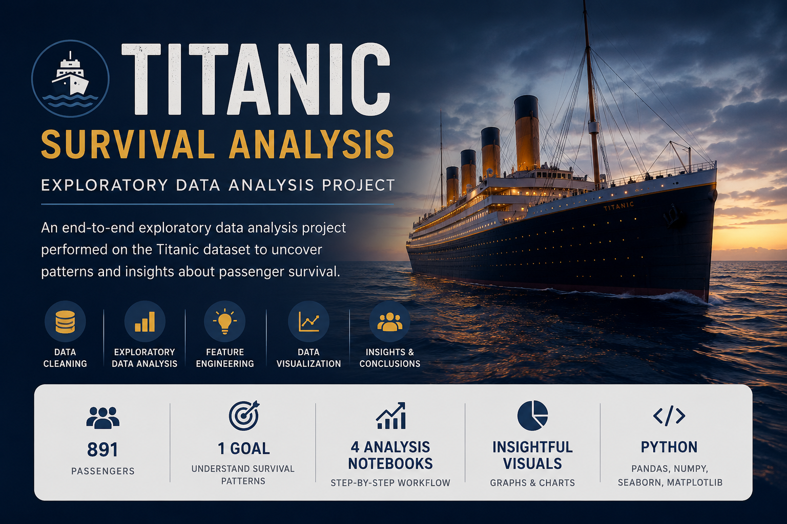

<p align="center">
  
</p>

# Titanic Survival Analysis - Exploratory Data Analysis Project

## About This Project

This project explores the Titanic passenger dataset to understand which factors may have influenced passenger survival. The analysis focuses on cleaning raw data, exploring relationships between variables, creating new features, and using visualizations to uncover patterns.

The goal of this project was not only to create graphs, but also to understand how real-world datasets are prepared and analyzed before drawing conclusions.

---

## Project Objectives

* Clean and prepare raw passenger data
* Perform exploratory data analysis (EDA)
* Create useful features from existing columns
* Identify patterns related to passenger survival
* Present findings using visualizations and analytical reasoning

---

## Dataset Information

The dataset contains passenger information from the Titanic disaster including:

* Passenger demographics
* Ticket and fare information
* Travel class information
* Family relationships
* Survival outcomes

Dataset Size:

* Rows: 891
* Columns: 12 (original dataset)

---

## Project Structure

```text
Titanic-EDA-Project/

├── data/
│   ├── raw/
│   └── processed/
│
├── notebook/
│   ├── 01_data_cleaning.ipynb
│   ├── 02_eda_analysis.ipynb
│   ├── 03_feature_engineering.ipynb
│   └── 04_final_visuals.ipynb
│
├── images/
├── reports/
├── requirements.txt
├── README.md
└── .gitignore
```

---

## Workflow Followed

### 1. Data Cleaning

* Removed unnecessary columns
* Handled missing values
* Checked duplicate entries
* Prepared processed datasets

### 2. Exploratory Data Analysis

Analysis was performed to understand:

* Gender vs Survival
* Passenger Class vs Survival
* Fare vs Survival
* Age Distribution
* Family Relationships

### 3. Feature Engineering

Additional features created:

* FamilySize
* IsAlone
* Title Extraction

These features helped reveal additional patterns beyond the original dataset.

---

## Key Findings

Some observations from the analysis:

* Female passengers showed noticeably higher survival rates
* Passenger class appears strongly related to survival probability
* Higher fare passengers generally survived more frequently
* Smaller family groups showed better survival outcomes compared to very large groups
* Survival patterns appear influenced by multiple factors rather than a single variable

---

## Technologies Used

* Python
* Pandas
* NumPy
* Matplotlib
* Seaborn
* Jupyter Notebook

---

## Sample Visualizations

Example visualizations used throughout analysis:

* Gender vs Survival
* Passenger Class vs Survival
* Fare Distribution
* Correlation Heatmaps
* Family Size Analysis

---

## How To Run

Clone repository:

```bash
git clone <repository-url>
```

Move into project folder:

```bash
cd Titanic-EDA-Project
```

Install dependencies:

```bash
pip install -r requirements.txt
```

Launch Jupyter:

```bash
jupyter notebook
```

---

## Final Thoughts

This project was built to practice a complete exploratory data analysis workflow — starting from raw data and ending with conclusions supported by visual evidence.

Rather than focusing only on code execution, this project emphasizes understanding the reasoning behind analytical decisions and interpreting results meaningfully.
